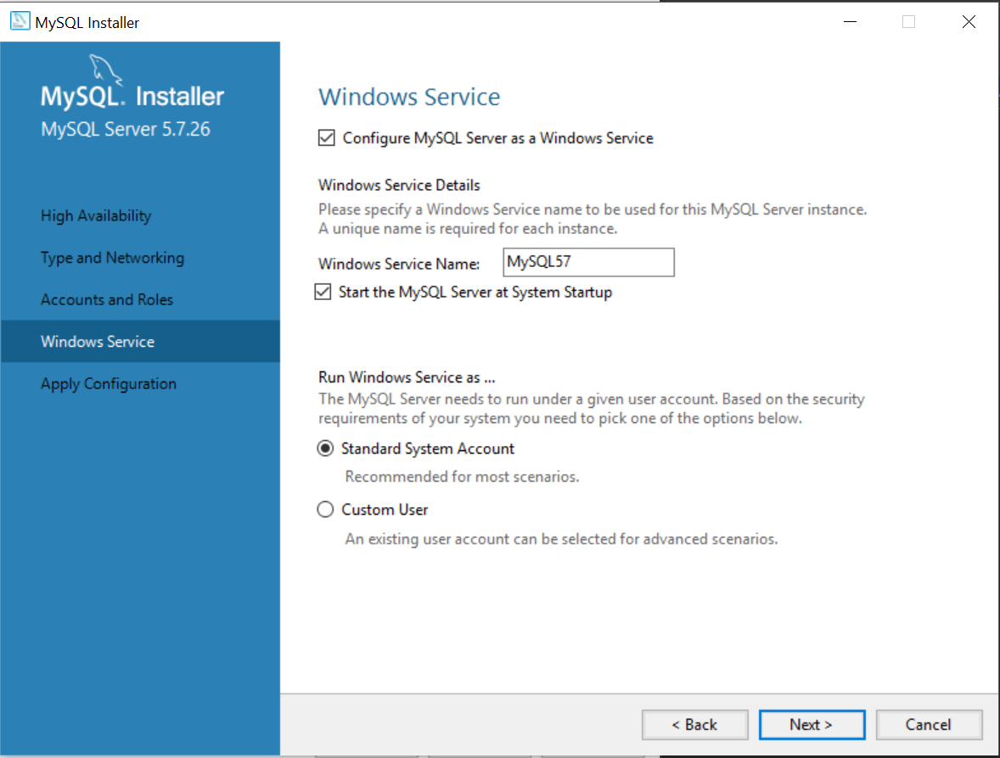

## Instalacja

1. Pobieramy i instalujemy najnowszą wersję serwera MySQL Community Server z [https://dev.mysql.com/downloads/windows/installer/8.0.html](https://dev.mysql.com/downloads/windows/installer/8.0.html)
2. Podczas instalacji wybieramy pierwszą opcję
    
3. Następnie domyślne opcje
    
4. Ustawiamy hasło na root (może być proste, ponieważ to lokalna instancja serwera)
    
5. Zatwierdzamy domyślne ustawienia i kończymy cały pcoes
    

## Zmienna środowiskowa
1. Ustawiamy zmienną środowiskową do naszej zmiennej `Path` wskazującą na katalog `bin`
U mnie to `C:\Program Files\MySQL\MySQL Server 8.0\bin`
2. Sprawdzamy wpisując w konsoli:
```
mysql --version
```

## Instalujemy MySQL Workbench

Pobieramy instalkę z [https://dev.mysql.com/downloads/workbench/](https://dev.mysql.com/downloads/workbench/)

## Ustawiamy poprawne kodowanie baz
1. Uruchamiamy MySQL Workbench i wybieramy opcję po lewo `Options File`
2. W okno powyżej `Locate option` wpisujemy `collation`
* zaznaczamy opcje `character-set-server` z wpisanym `utf8mb4`
* zaznaczamy opcje `collation-server` z wpisanym `utf8mb4_0900_ai_ci`
* zaznaczamy opcje `default_collation_for_utf8mb4` z wybranym `utf8`
3. Wciskamy przycisk `Apply` na dole i czekamy na restart serwera.

